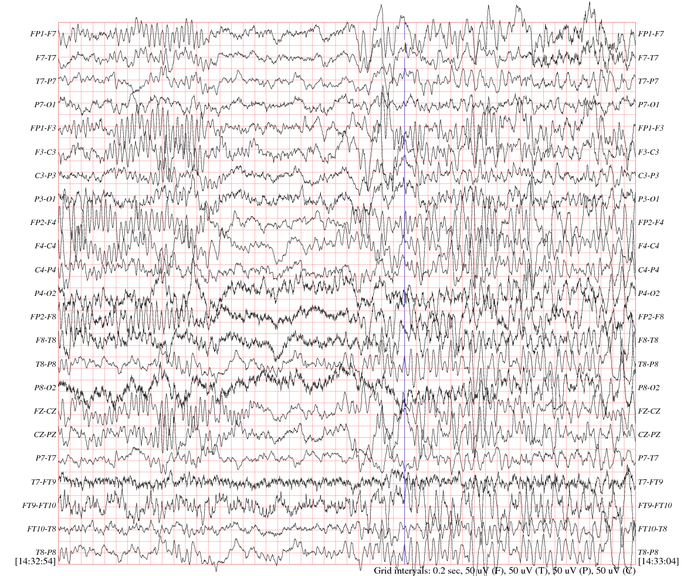

# CHB-MIT Scalp EEG Database
https://www.physionet.org/pn6/chbmit/

# Visualize the data
**[Check out the dataset on Lightwave](https://physionet.org/lightwave/?db=chbmit&record=chb01/chb01_01.edf)**

# Dataset Description
- Nb Sujects: 22
- Sampling Frequency: 256Hz
- 23 cases, were collected from 22 subjects.

*Case chb21 was obtained 1.5 years after case chb01, from the same female subject.*   
*Case chb24 was added to this collection in December 2010, and is not currently included in SUBJECT-INFO.*

## Files

* RECORDS: lists all 664 .edf files included in this collection
* RECORDS-WITH-SEIZURES: lists the 129 of those files that contain one or more seizures. 
* RECORDS-WITH-SEIZURES

In all, these records include 198 seizures (182 in the original set of 23 cases).   
The beginning ([) and end (]) of each seizure is annotated in the .seizure annotation files.

# State of the Art - Results

[ToDo]

# Notebooks
1. [LSTM](CHB-MIT_LSTM.ipynb) (Colab Ready)
2. [CNN]() (Colab Ready)

